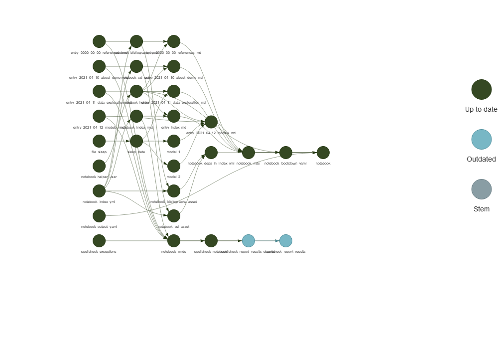

<!-- README.md is generated from README.Rmd. Please edit that file -->

# notestar-demo

<!-- badges: start -->
<!-- badges: end -->

An example analysis notebook created with
[notestar](https://github.com/tjmahr/notestar). The notebook can be
[previewed here](http://www.tjmahr.com/notestar-demo/index.html).

------------------------------------------------------------------------

Steps I used to make this demo from scratch.

1.  Create a new project in RStudio with git repository.

2.  Performed first git commit.

3.  `usethis::use_readme_rmd()` to start writing down these steps.

4.  `notestar::use_notestar()`, `notestar:::use_notestar_makefile()`,
    `notestar::use_notestar_references()`

5.  Edited `index.Rmd`, `_targets.R` and `R/functions.R` to create some
    workflow items, including `data/sleepstudy.csv`.

6.  Created some entries and wrote them for the demo.

``` r
notestar::notebook_create_page(date = "2021-04-10", slug = "about-demo")
notestar::notebook_create_page(date = "2021-04-11", slug = "data-exploration")
notestar::notebook_create_page(date = "2021-04-12", slug = "models")
```

7.  `targets::tar_make()` or the Build (Ctrl+B) shortcut in RStudio
    along the way.

8.  `notestar::notebook_browse()` to view the notebook.

Iterating on steps 5–10 is the main flow for the notebook. We set up
data and modeling things in `_targets` and explore/report them in
notebook entries.

10. Committed files and create repository with `usethis::use_github()`

11. Added link to repository to index.Rmd.

12. Copied the `notebook.html` file into `docs/index.html` so that it
    could be previewed with Github Pages.

------------------------------------------------------------------------

How the data/modeling flow into the notebook entries and into the final
notebook:

``` r
targets::tar_visnetwork(targets_only = TRUE)
#> ── Attaching packages ─────────────────────────────────────── tidyverse 1.3.1 ──
#> ✓ ggplot2 3.3.5     ✓ purrr   0.3.4
#> ✓ tibble  3.1.6     ✓ dplyr   1.0.8
#> ✓ tidyr   1.2.0     ✓ stringr 1.4.0
#> ✓ readr   2.1.2     ✓ forcats 0.5.1
#> ── Conflicts ────────────────────────────────────────── tidyverse_conflicts() ──
#> x dplyr::filter() masks stats::filter()
#> x dplyr::lag()    masks stats::lag()
#> Loading required package: Rcpp
#> Loading 'brms' package (version 2.16.3). Useful instructions
#> can be found by typing help('brms'). A more detailed introduction
#> to the package is available through vignette('brms_overview').
#> 
#> Attaching package: 'brms'
#> 
#> The following object is masked from 'package:stats':
#> 
#>     ar
#> 
```

<!-- -->
