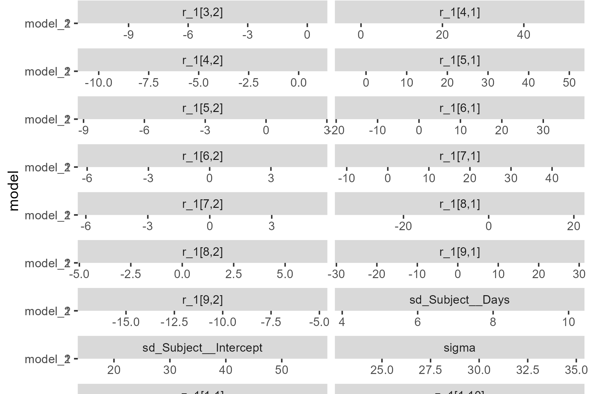

<!--- Timestamp to trigger book rebuilds: 2021-04-14 09:40:11 --->


## Apr. 12, 2021 (Mixed models)

<small>Source: <code>2021-04-12-models.Rmd</code></small>

We fit two mixed models on the sleep dataset using brms. 

One with random intercepts:


```r
library(tidyverse)
#> -- Attaching packages --------------------------------------- tidyverse 1.3.0 --
#> v ggplot2 3.3.3     v purrr   0.3.4
#> v tibble  3.1.0     v dplyr   1.0.5
#> v tidyr   1.1.3     v stringr 1.4.0
#> v readr   1.4.0     v forcats 0.5.1
#> -- Conflicts ------------------------------------------ tidyverse_conflicts() --
#> x dplyr::filter() masks stats::filter()
#> x dplyr::lag()    masks stats::lag()
library(brms)
#> Loading required package: Rcpp
#> Loading 'brms' package (version 2.15.0). Useful instructions
#> can be found by typing help('brms'). A more detailed introduction
#> to the package is available through vignette('brms_overview').
#> 
#> Attaching package: 'brms'
#> The following object is masked from 'package:stats':
#> 
#>     ar
model_1 <- targets::tar_read(model_1)
model_2 <- targets::tar_read(model_2)

model_1
#>  Family: gaussian 
#>   Links: mu = identity; sigma = identity 
#> Formula: Reaction ~ Days + (1 | Subject) 
#>    Data: data (Number of observations: 180) 
#> Samples: 4 chains, each with iter = 2000; warmup = 1000; thin = 1;
#>          total post-warmup samples = 4000
#> 
#> Group-Level Effects: 
#> ~Subject (Number of levels: 18) 
#>               Estimate Est.Error l-95% CI u-95% CI Rhat Bulk_ESS Tail_ESS
#> sd(Intercept)    39.67      7.84    27.72    57.93 1.00      799     1076
#> 
#> Population-Level Effects: 
#>           Estimate Est.Error l-95% CI u-95% CI Rhat Bulk_ESS Tail_ESS
#> Intercept   251.40     10.48   231.62   272.46 1.00      669     1165
#> Days         10.47      0.83     8.87    12.12 1.00     3802     2854
#> 
#> Family Specific Parameters: 
#>       Estimate Est.Error l-95% CI u-95% CI Rhat Bulk_ESS Tail_ESS
#> sigma    31.19      1.78    27.92    34.93 1.00     3943     2794
#> 
#> Samples were drawn using sampling(NUTS). For each parameter, Bulk_ESS
#> and Tail_ESS are effective sample size measures, and Rhat is the potential
#> scale reduction factor on split chains (at convergence, Rhat = 1).
```

And one with random slopes.


```r
model_2
#>  Family: gaussian 
#>   Links: mu = identity; sigma = identity 
#> Formula: Reaction ~ Days + (Days | Subject) 
#>    Data: data (Number of observations: 180) 
#> Samples: 4 chains, each with iter = 2000; warmup = 1000; thin = 1;
#>          total post-warmup samples = 4000
#> 
#> Group-Level Effects: 
#> ~Subject (Number of levels: 18) 
#>                     Estimate Est.Error l-95% CI u-95% CI Rhat Bulk_ESS Tail_ESS
#> sd(Intercept)          26.81      6.60    16.00    41.68 1.00     1738     2382
#> sd(Days)                6.52      1.52     4.14    10.14 1.00     1501     1920
#> cor(Intercept,Days)     0.09      0.30    -0.47     0.66 1.00      999     1821
#> 
#> Population-Level Effects: 
#>           Estimate Est.Error l-95% CI u-95% CI Rhat Bulk_ESS Tail_ESS
#> Intercept   251.23      7.33   236.62   265.29 1.00     1914     2394
#> Days         10.35      1.69     6.96    13.71 1.00     1346     1489
#> 
#> Family Specific Parameters: 
#>       Estimate Est.Error l-95% CI u-95% CI Rhat Bulk_ESS Tail_ESS
#> sigma    25.92      1.59    22.92    29.30 1.00     3824     2697
#> 
#> Samples were drawn using sampling(NUTS). For each parameter, Bulk_ESS
#> and Tail_ESS are effective sample size measures, and Rhat is the potential
#> scale reduction factor on split chains (at convergence, Rhat = 1).
```

We might look at the overall, subject-level effects in the two models.


```r
summary_1 <- model_1 %>% 
  posterior_summary() %>% 
  as_tibble(rownames = "parameter") %>% 
  mutate(model = "model_1")

summary_2 <- model_2 %>% 
  posterior_summary() %>% 
  as_tibble(rownames = "parameter") %>% 
  mutate(model = "model_2")
head(summary_2)
#> # A tibble: 6 x 6
#>   parameter                    Estimate Est.Error    Q2.5   Q97.5 model  
#>   <chr>                           <dbl>     <dbl>   <dbl>   <dbl> <chr>  
#> 1 b_Intercept                  251.         7.33  237.    265.    model_2
#> 2 b_Days                        10.4        1.69    6.96   13.7   model_2
#> 3 sd_Subject__Intercept         26.8        6.60   16.0    41.7   model_2
#> 4 sd_Subject__Days               6.52       1.52    4.14   10.1   model_2
#> 5 cor_Subject__Intercept__Days   0.0917     0.297  -0.467   0.659 model_2
#> 6 sigma                         25.9        1.59   22.9    29.3   model_2
summary <- bind_rows(summary_1, summary_2) %>% 
  filter(!stringr::str_detect(parameter, "^r_Subject")) 

ggplot(summary) + 
  aes(x = Estimate, y = model) + 
  geom_pointrange(aes(xmin = Q2.5, xmax = Q97.5), position = position_dodge()) + 
  facet_wrap("parameter", scales = "free_x", ncol = 2)
#> Warning: Width not defined. Set with `position_dodge(width = ?)`
```



### Model comparison

As part of the build pipeline, we computed a leave-one-out information criteria
(LOOIC) and LOO-weighted Bayesian R-squared statistic. Let's look at the R2
first. 


```r
loo_R2(model_1)
#>     Estimate  Est.Error      Q2.5     Q97.5
#> R2 0.6609046 0.04835359 0.5569746 0.7420704
loo_R2(model_2)
#>     Estimate  Est.Error      Q2.5     Q97.5
#> R2 0.7478346 0.05306317 0.6277064 0.8315969
```

This comparison would favor the second model.


Let's compare the LOOIC values. The second model has lower LOOIC values.


```r
loo(model_1)
#> 
#> Computed from 4000 by 180 log-likelihood matrix
#> 
#>          Estimate   SE
#> elpd_loo   -885.1 14.5
#> p_loo        19.6  3.5
#> looic      1770.1 29.0
#> ------
#> Monte Carlo SE of elpd_loo is NA.
#> 
#> Pareto k diagnostic values:
#>                          Count Pct.    Min. n_eff
#> (-Inf, 0.5]   (good)     179   99.4%   505       
#>  (0.5, 0.7]   (ok)         0    0.0%   <NA>      
#>    (0.7, 1]   (bad)        1    0.6%   66        
#>    (1, Inf)   (very bad)   0    0.0%   <NA>      
#> See help('pareto-k-diagnostic') for details.

loo(model_2)
#> 
#> Computed from 4000 by 180 log-likelihood matrix
#> 
#>          Estimate   SE
#> elpd_loo   -861.4 22.5
#> p_loo        34.2  8.5
#> looic      1722.7 45.0
#> ------
#> Monte Carlo SE of elpd_loo is NA.
#> 
#> Pareto k diagnostic values:
#>                          Count Pct.    Min. n_eff
#> (-Inf, 0.5]   (good)     172   95.6%   806       
#>  (0.5, 0.7]   (ok)         5    2.8%   515       
#>    (0.7, 1]   (bad)        2    1.1%   17        
#>    (1, Inf)   (very bad)   1    0.6%   11        
#> See help('pareto-k-diagnostic') for details.
```

We could report a difference. 


```r
loo_compare(model_1, model_2)
#>         elpd_diff se_diff
#> model_2   0.0       0.0  
#> model_1 -23.7      11.7
```

These would have to multiplied by -2 to be on the deviance scale.
